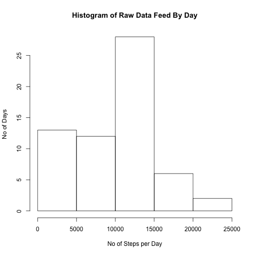

This is an R Markdown document. Markdown is a simple formatting syntax for authoring HTML, PDF, and MS Word documents. For more details on using R Markdown see <http://rmarkdown.rstudio.com>.

When you click the **Knit** button a document will be generated that includes both content as well as the output of any embedded R code chunks within the document. You can embed an R code chunk like this:


```r
options(scipen=99)
library(sqldf)
library(lattice) 

setwd("/Users/rgangadharan/Development/RProgramming/ReproducibleResearch/RepData_PeerAssessment1-master/RepData_PeerAssessment1")
download.file("https://d396qusza40orc.cloudfront.net/repdata%2Fdata%2Factivity.zip",method="curl",destfile="a.zip")

#1 Processing of Raw Data
rawData <- read.table(unz("a.zip", "activity.csv"),sep=",",dec=".", header = TRUE)
rawDataByDay <- aggregate(rawData$steps, by=list(Date=rawData$date), FUN=sum, na.rm=TRUE)
```


```r
#2 Histogram
hist(rawDataByDay$x, xlab = "No of Steps per Day", ylab = "No of Days", main = "Histogram of Raw Data Feed By Day")
```




```r
#3 Mean and Median
median(rawDataByDay$x)
```

```
## [1] 10395
```

```r
mean(rawDataByDay$x)
```

```
## [1] 9354.23
```

You can also embed plots, for example:


```r
#4 Time Series Plot
plot(rawDataByDay$Date,rawDataByDay$x)
lines(rawDataByDay$Date,rawDataByDay$x,type="l")
```


```r
#5 Interval with Max no of Steps
#5 Interval with Max no of Steps
rawDataByInterval <- aggregate(rawData$steps, by=list(interval=rawData$interval), FUN=mean, na.rm=TRUE)
sqldf("select * from rawDataByInterval where x in  (select max(x) from rawDataByInterval)")
```

```
##   interval        x
## 1      835 206.1698
```

```r
#6 Fix N/A data in raw Data
data <- rawData
for (i in 1:nrow(data))
{
  if (is.na(rawData$steps[i]) ) 
  {
    interval = data$interval[i]
    data$steps[i] = round(subset(rawDataByInterval,rawDataByInterval$interval==interval)$x[1])
  }
}


#7 Histogram of cleaned up data
dataByDay <- aggregate(data$steps, by=list(Date=data$date), FUN=sum, na.rm=TRUE)
```


```r
hist(dataByDay$x, xlab = "No of Steps per Day", ylab = "No of Days", main ="Histogram of Cleaned up Data by Day")
```


```r
#8 Panel plot comparing the average number of steps taken per 5-minute interval across weekdays and weekends

weekdays = c("Monday","Tuesday","Wednesday","Thursday","Friday")
weekend = c("Saturday", "Sunday")

data$date = as.Date(data$date,format = "%Y-%m-%d")
data$weekDay = weekdays(data$date)

data$weekDay[data$weekDay %in% weekdays] <- 1
data$weekDay[data$weekDay %in% weekend]  <- 0
dataByInterval <- aggregate(data$steps, by=list(interval=data$interval,weekDay=data$weekDay), FUN=mean, na.rm=TRUE)
dataByInterval$weekDay.f<-factor(dataByInterval$weekDay,levels=c(0,1),
               labels=c("Weekend","WeekDays"))
```


```r
xyplot(dataByInterval$x~dataByInterval$interval|dataByInterval$weekDay.f,
          type="l",layout=c(1,2),
          plot.points = FALSE, auto.key = TRUE,
          main="Distribution of No Of Steps Over the entire Day",
          xlab="Time Interval",
          ylab="No Of Steps")
```


